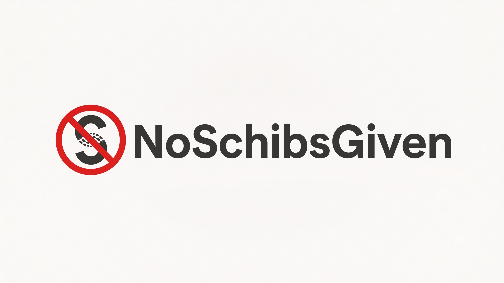

<p align="center">
  
</p>

<p align="center">
  <em>No Schibsted-given consent popups. Ever.</em>
</p>

<p align="center">
  <a href="../../releases"></a>
  
  
</p>

---

Schibsted krever opptil 49 kr/md for å avvise annonsesporing. Datatilsynet og Forbrukerrådet mener det bryter med GDPR. Denne utvidelsen blokkerer popup-en helt — gratis, for alle.

> *«Personvern er en menneskerett som man ikke skal måtte betale for.»*  
> — Line Coll, direktør i Datatilsynet

🔗 [Datatilsynet: Schibsted tek betalt for personvern](https://www.datatilsynet.no/aktuelt/aktuelle-nyheter-2026/schibsted-tek-betalt-for-personvern/) *(april 2026)*  
🔗 [Forbrukerrådet klager inn Schibsted til Datatilsynet](https://rett24.no/articles/forbrukerradet-klager-schibsted-inn-til-datatilsynet-for-betaling-for-personvern) *(juni 2026)*

---

## 📥 Nedlasting

Gå til **[Releases](../../releases)** og last ned riktig fil for din nettleser:

| Nettleser | Fil |
|-----------|-----|
| Chrome | `noschibsgiven-chromium-vX.X.zip` |
| Edge | `noschibsgiven-chromium-vX.X.zip` |
| Opera | `noschibsgiven-chromium-vX.X.zip` |
| Brave | `noschibsgiven-chromium-vX.X.zip` |
| Vivaldi | `noschibsgiven-chromium-vX.X.zip` |
| Firefox | `noschibsgiven-firefox-vX.X.zip` |
| Safari | [Se nedenfor ↓](#-safari) |

---

## 🔧 Installasjon

### Chrome

1. Last ned `noschibsgiven-chromium-vX.X.zip` og pakk den ut (høyreklikk → *Pakk ut alle*)
2. Åpne Chrome og gå til `chrome://extensions/`
3. Skru på **Utviklermodus** øverst til høyre
4. Klikk **Last inn upakket** og velg mappen du pakket ut
5. Ferdig — utvidelsen er aktiv ✅

### Edge

1. Last ned og pakk ut `noschibsgiven-chromium-vX.X.zip`
2. Åpne Edge og gå til `edge://extensions/`
3. Skru på **Utviklermodus** nederst til venstre
4. Klikk **Last inn upakket** og velg mappen
5. Ferdig ✅

### Opera

1. Last ned og pakk ut `noschibsgiven-chromium-vX.X.zip`
2. Åpne Opera og gå til `opera://extensions/`
3. Skru på **Utviklermodus** øverst til høyre
4. Klikk **Last inn upakket** og velg mappen
5. Ferdig ✅

### Brave

1. Last ned og pakk ut `noschibsgiven-chromium-vX.X.zip`
2. Åpne Brave og gå til `brave://extensions/`
3. Skru på **Utviklermodus** øverst til høyre
4. Klikk **Last inn upakket** og velg mappen
5. Ferdig ✅

### Vivaldi

1. Last ned og pakk ut `noschibsgiven-chromium-vX.X.zip`
2. Åpne Vivaldi og gå til `vivaldi://extensions/`
3. Skru på **Utviklermodus** øverst til høyre
4. Klikk **Last inn upakket** og velg mappen
5. Ferdig ✅

### Firefox

1. Last ned og pakk ut `noschibsgiven-firefox-vX.X.zip`
2. Åpne Firefox og gå til `about:debugging`
3. Klikk **This Firefox** i menyen til venstre
4. Klikk **Load Temporary Add-on...**
5. Gå inn i mappen du pakket ut og velg filen `manifest.json`
6. Ferdig ✅

> ⚠️ **Merk:** Midlertidig installasjon forsvinner når Firefox lukkes. For permanent installasjon uten signering, bruk [Firefox Developer Edition](https://www.mozilla.org/firefox/developer/) og sett `xpinstall.signatures.required` til `false` i `about:config`.

### 🍎 Safari

Safari støtter dessverre ikke direkte installasjon av utvidelser fra ZIP-filer slik som Chrome og Firefox gjør. Installasjon på Safari krever Xcode og er beregnet på utviklere.

**Alternativ for Mac-brukere:** Vi anbefaler å bruke [Chrome for Mac](https://www.google.com/chrome/) som er gratis og støtter enkel installasjon via stegene over.

> Vil du bidra til å lage en offisiell Safari-versjon? Se [Bidra](#-bidra) nedenfor.

---

## 🛡️ Hvordan det fungerer

Utvidelsen bruker to lag med beskyttelse:

1. **Nettverksblokkering** — Blokkerer på nettverksnivå:
   - SourcePoint sine servere (`cdn.privacy-mgmt.com`) — popup-scriptet laster aldri inn
   - Schibsted sitt eget CMP (`cmp.tek.no`, `cmp.vg.no`, osv.)
   - Schibsted tracking og analytics (`sdk.pulse.schibsted.com`, `log.mediafall.no`, `static.privacy.schibsted.com`, `ads.inventory.schibsted.io`)
   - Tredjeparts annonsenettverk (AppNexus, Datadog, Azure ad SDK) — **kun** på Schibsted Media-sider
2. **DOM-cleanup** — Et backup-script fjerner eventuelle gjenværende samtykke-elementer automatisk når siden lastes. På Schibsted-sider ryddes også `localStorage`-nøkler som SourcePoint bruker til å huske samtykke.

SourcePoint-blokkeringen fungerer på **alle** nettsider som bruker SourcePoint som CMP. Schibsted-spesifikk tracking-blokkering gjelder Schibsted Media-sider:

`tek.no` · `vg.no` · `bt.no` · `ba.no` · `e24.no` · `aftenposten.no` · `ap.no` · `aftonbladet.se` · `omni.se` · `hbl.fi` · `dn.no` · `godt.no` · `side2.no` · `vgd.no` · `svd.se`

### Hva utvidelsen ikke blokkerer

- Serverside logging (HTTP access logs, CDN-logger)
- Tracking på andre nettsider enn Schibsted Media
- **finn.no** (egen plattform, ikke dekket)

### Kjente begrensninger

- **Schibsted Plus / betaling:** Domener som `session-service.payment.schibsted.no` blokkeres fordi de brukes til sporing. Dette kan i noen tilfeller påvirke innloggings- eller betalingsflyt. Rapporter gjerne om du opplever problemer.
- **Firefox:** Midlertidig installasjon krever manuell lasting ved hver oppstart (se installasjonssteg over).

Fant du et nytt tracking-domene? Bruk [issue-malen for nye domener](../../issues/new?template=nytt-domene.md) eller åpne en vanlig [Issue](../../issues).

---

## 🛠️ Utvikling

Krever [Node.js](https://nodejs.org/) 18+.

```bash
# Generer rules.json og manifest fra src/config.json
npm run generate

# Valider at regler og host_permissions er konsistente
npm run validate

# Bygg ZIP-pakker til dist/
npm run build
```

**Filstruktur:**

| Fil | Formål |
|-----|--------|
| `src/config.json` | Domener og blokkeringslister (én kilde) |
| `src/content.js` | DOM-cleanup og scroll-opplåsing |
| `scripts/generate.mjs` | Genererer `rules.json` og manifester |
| `scripts/validate.mjs` | Sjekker konsistens før build |
| `scripts/build.mjs` | Pakker Chromium- og Firefox-ZIP |

For å legge til et nytt domene: oppdater `src/config.json`, kjør `npm run build`, og test på siden.

Endringslogg: se [CHANGELOG.md](CHANGELOG.md).

---

## 🤝 Bidra

Innspill, feilmeldinger og pull requests er velkomne!  
Åpne en [Issue](../../issues) eller send e-post til **evail@protonmail.com**

Vil du hjelpe med Safari-versjon? Ta kontakt — det trengs noen med Mac og Xcode.

---

## 📄 Lisens

MIT
